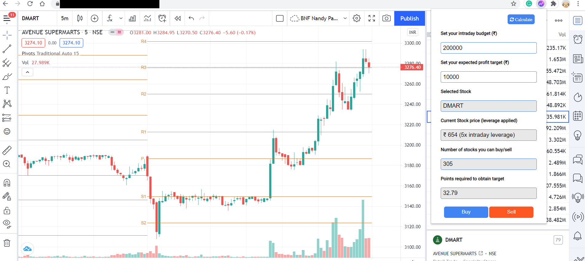

# TradingView-Extension
A chrome extension that extends tradingview charts by facilitating order creation in Zerodha Kite.

## Capabilities
Currently, the extension takes in your intraday budget (mandatory) and profit target (option) as the input parameters. Based on the input, it calculates the stocks that can be alloted (long)/sold off (short). It takes a single button click to place the order in Zerodha Kite platform.

Supports Nifty 200 stocks only.

## Installation
1. Clone project
2. Create a API key from Kite Developer platform.
3. Replace `API_KEY` value in `index.html`.
4. Open `chrome:\\extensions` and enable developer mode.
5. Upload the extension using `Load unpacked`.
6. Go to tradingview charts, select a nifty 200 stock and click on thee extension.

## Screenshots

Trading view -

Order view -

